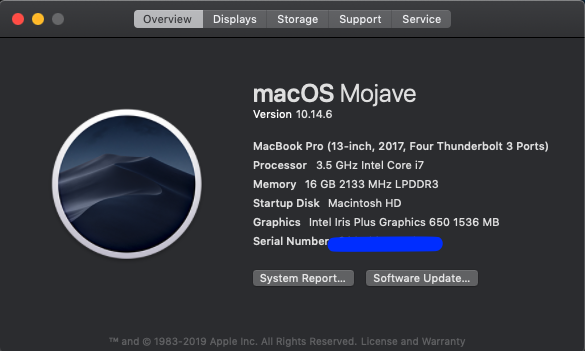
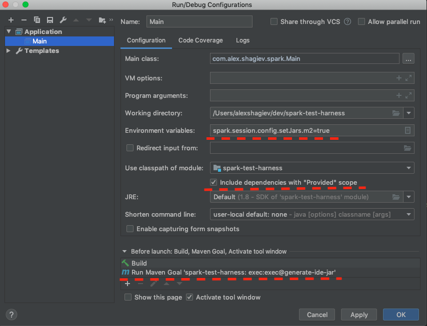

# Spark performance test harness
## Goal of this test harness
* This program's aim is to measure spark performance on a number of operations and and typical use cases.
  * Parsing of JSONL Dataframe file. JSONL Dataframe file is a format designed to be human readable text while somewhat
  optimized for large data transfers over the network. It essentially includes exactly ONE meta data line that defines
  data types column names for the consecutive lines that contain compact arrays of data. Current JSONL Dataframe assumes 
  support for the following types:
    * String, LocalDate, Timestamp, BigDecimal, BigInteger, Array<BigDecimal>, Array<BigInteger>
  * Supporting scripts create a number of JSONL Dataframe files of sizes that vary in number of rows as well as number 
  of columns with enough scenarios to give you a sense for spark performance of both parsing this data and converting 
  it to a spark Dataframe as well as performing operations such as count and save to hdfs 
    
# Build/Run Environment setup
## Tested on Mac OS

***
# HDFS Install & Starting Service
## Install hadoop - `brew install hadoop@3.1.2`
  * This will install hadoop and hdfs service under `/usr/local/Cellar/hadoop/3.1.2`
  * All further hadoop references will be relative to the hadoop install path above
  * Change `hadoop.tmp.dir` in `libexec/etc/hadoop/core-default.xml` to be `~/hadoop-storage` otherwise the default `/tmp/hadoop-${user.name}` 
location gets erased after reboot and hdfs gets corrupted and needs reformatting
  * Enabled Pseudo-Distributed Operations mode. Summary below, more at [hadoop.apache.org](https://hadoop.apache.org/docs/stable/hadoop-project-dist/hadoop-common/SingleCluster.html#Pseudo-Distributed_Operation)
    * Add below in `libexec/etc/hadoop/core-site.xml`
    ~~~xml
    <configuration>
        <property>
            <name>fs.defaultFS</name>
            <value>hdfs://localhost:9000</value>
        </property>
    </configuration>
    ~~~
    * Add below in `libexec/etc/hadoop/hdfs-site.xml`
    ~~~xml
    <configuration>
        <property>
            <name>dfs.replication</name>
            <value>1</value>
        </property>
    </configuration>
    ~~~
    * Check that `ssh localhost` works if does not follow
    ~~~shell script
    $ ssh-keygen -t rsa -P '' -f ~/.ssh/id_rsa
    $ cat ~/.ssh/id_rsa.pub >> ~/.ssh/authorized_keys
    $ chmod 0600 ~/.ssh/authorized_keys 
    ~~~
    * Format file system - `bin/hdfs namenode -format`
## Start Hadoop file system - `libexec/sbin/start-dfs.sh`
   * You should be able to see your HDFS file system here now - http://localhost:9870/
   * Create Home directory where the data will be saved during performance testing `bin/hdfs dfs -mkdir -p /user/test-harness`
   * To stop the service execute `libexec/sbin/stop-dfs.sh`

## Load HDFS with randomly generated data samples.
* Scripts generating data samples are written in python can be executed using a maven gaol. Hence we recommend you 
install maven as well as anaconda and create environment using provided recipe.
* Install maven - `brew install mvn`
* Install anaconda which will include python - `brew casks install anaconda`
* Create a python environment which will install necessary hdfs and other libraries - `conda env create -f ./scenario-file-generator/conda.recipe/test-harness.yml`
* Initialize your bash profile to recognize conda - `conda init bash` and restart your terminal
* Activate conda environment you had created in a prior step - `conda activate test-harness`
* Run maven goal - `mvn exec:exec@generate-test-harness-files` - this will generate random data samples based on the 
scenarios defined in [application.conf scenarios/run section](./src/main/resources/application.conf)
* You should be able to see new data files created here [hdfs://localhost:9000/user/test-harness/data/l0](http://localhost:9870/explorer.html#/user/test-harness/data/l0/jsonl)

# Spark Install & Starting Stand Alone Service
## Install Spark
* Install - `brew install apache-spark@2.4.3`
* This will install apache spark service under `/usr/local/Cellar/apache-spark/2.4.3/`
* All further hadoop references will be relative to the hadoop install path above
## Start Stand Alone Spark - `libexec/sbin/start-all.sh`
* You should be able to see your cluster running here http://localhost:8080
* Your default master url should be set to `spark://localhost:7077`
* To stop the service execute `libexec/sbin/stop-all.sh`

# Running test harness
# Submitting spark job using pre-defined spark-submit via maven plugin
1. `mvn -DskipTests -Dspark.cores.max=4 package exec:exec@run-stand-alone`
   * This command will create an UBER jar and submit it into the stand alone cluster, spark url is defined in [application.conf conf/spark section](./src/main/resources/application.conf)
   * You can change this option `spark.cores.max` to see how well the scenario scales with less or more cores. 
   When missing a max `1024` cores will be used if available. Typically running this harness on a single host will result in 4 cores

# Submitting spark job using InteliJ Run/Debug mode
1. Make the following class to be your main `com.alex.shagiev.spark.Main`
1. Enable `Include dependencies with "Provided" Scope` option in the Run/Debug configuration. See: Figure #1
2. Add maven goal `mvn exec:exec@generate-ide-jar` in the Rub/Debug configuration. This will create an IDE jar out of scala 
classes provided in this project `./target/ide-${project.artifactId}-${project.version}.jar`
  * Be sure to manually add this jar file is as a projects dependency.
3. Add environment variable `spark.session.config.setJars.m2=true`, this will add add Jars from maven classpath and IDE jar
to the spark context so that spark executors have access to the necessary code and dependencies. 

###Figure 1

# References
* [Maven](https://spark.apache.org)
* [Maven for scala](https://docs.scala-lang.org/tutorials/scala-with-maven.html)
* [Brew](https://brew.sh)
* [Hadoop](https://hadoop.apache.org)
* [Apache Spark](https://spark.apache.org)