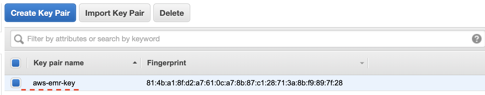
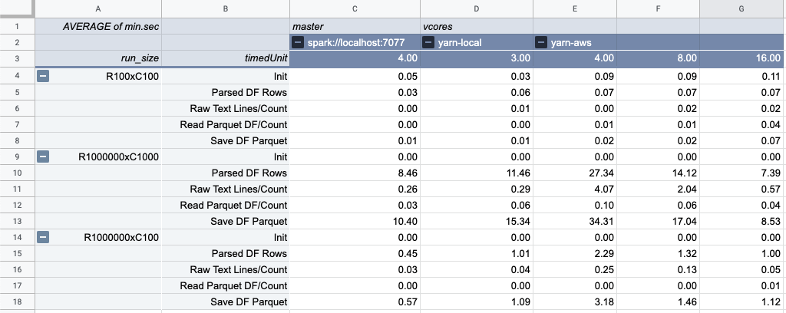

# Spark performance test harness

## Goal of this test harness

* This program's aim is to measure spark performance on a number of operations and and typical use cases.
  * Parsing of JSONL Dataframe file. JSONL Dataframe file is a format designed to be human readable text while somewhat
  optimized for large data transfers over the network. It essentially includes exactly ONE meta data line that defines
  data types column names for the consecutive lines that contain compact arrays of data. Current JSONL Dataframe assumes 
  support for the following types:
    * String, LocalDate, Timestamp, BigDecimal, BigInteger, Array<BigDecimal>, Array<BigInteger>
  * Example of JSONL format is below
  ~~~json
    { "metaData": {"columnNames": ["biz_date","a_fejcyllnrtyexcn","b_cvdxurcjmxfmmaj","c_yjxpaqarqvjbbrm","d_qddvzpgyipoqneg","e_tochpkfecrzqjcm","f_yrukoixpwewbhhq","g_jrplbebkluvzuat","h_zzbozoomdwxcqmu","i_bkylvzbbcskksyw","j_nfxjpiqbndrusth"] , "types": ["Date","String","Timestamp","Array<BigDecimal>","Array<BigDecimal>","Timestamp","Array<BigInteger>","BigInteger","Timestamp","Timestamp","BigInteger"]}}
    {"row":["20190615","AZJCXSXJBXLUWZDAXV","20190910-15:48:58.651173",null,[0.6366280649451527],"20190910-15:48:58.651333",[997],-82091895,"20190910-15:48:58.651426","20190910-15:48:58.651501",85624007]}
    {"row":["20190929","YCPPEHMZWIQMPTARXVW","20190910-15:48:58.651688",null,[0.8005208960967507, 0.4629934652532054],"20190910-15:48:58.651745",[326],79521309,"20190910-15:48:58.651834","20190910-15:48:58.651863",null]}
    {"row":["20190724",null,"20190910-15:48:58.651977",[0.8346759933473351, 0.01521255424173329],null,"20190910-15:48:58.652026",[155],77425,"20190910-15:48:58.652097","20190910-15:48:58.652124",-18037480]}
    {"row":["20190707",null,"20190910-15:48:58.652236",[0.08305561036338849],null,"20190910-15:48:58.652282",[670, 425],-12684310,"20190910-15:48:58.652352","20190910-15:48:58.652378",null]}
    {"row":["20190913",null,"20190910-15:48:58.652486",null,[0.9555277095824917, 0.7486451091305474],"20190910-15:48:58.652532",[141],null,"20190910-15:48:58.652602","20190910-15:48:58.652629",66233448]}
    {"row":["20190620",null,"20190910-15:48:58.652736",[0.18516659006570801],[0.41137015158232304, 0.6667256822041231],"20190910-15:48:58.652784",[260, 121],null,"20190910-15:48:58.652858","20190910-15:48:58.652886",27934970]}
    {"row":["20190615","GQGKJIVU","20190910-15:48:58.652989",[0.9892582343257756, 0.20150289076244832],[0.20469205499263377, 0.37458327057810803],"20190910-15:48:58.653041",null,-76530845,"20190910-15:48:58.653118","20190910-15:48:58.653148",51713610]}
    {"row":["20190915",null,"20190910-15:48:58.653254",[0.34918000670118776],[0.3699235272374676, 0.05527038650988347],"20190910-15:48:58.653301",[825, 232],-16111738,"20190910-15:48:58.653375","20190910-15:48:58.653403",-55494614]}
    {"row":["20190923",null,"20190910-15:48:58.653520",[0.48612117194554993, 0.1703540048180341],[0.5016211169401508],"20190910-15:48:58.653569",null,-79147816,"20190910-15:48:58.653640","20190910-15:48:58.653667",6043744]}
    {"row":["20191213","PUYIYDHANH","20190910-15:48:58.653770",[0.19424961886032033],[0.36394658213372477],"20190910-15:48:58.653821",[48, 474],-849174,"20190910-15:48:58.653897","20190910-15:48:58.653925",null]}
  ~~~
  * Supporting scripts create a number of JSONL Dataframe files of sizes that vary in number of rows as well as number 
  of columns with enough scenarios to give you a sense for spark performance of both parsing this data and converting 
  it to a spark Dataframe as well as performing operations such as count and save to hdfs 
    
# Build/Run Environment setup
## Tested on Mac OS
  * Instructions below will using [Homebrew](https://brew.sh/) if you don't already have it install it first.
   
    

***
# HDFS Install & Starting Service

## Install HDFS & Yarn
  * `brew install hadoop`
    * This will install hadoop that includes __HDFS__ and __YARN__ service under `/usr/local/Cellar/hadoop/3.1.2` which will
    references as `${HADOOP_HOME}` further in instructions.
  * Change property `hadoop.tmp.dir` to the following value `~/hadoop-storage`, in this file 
    `${HADOOP_HOME}/libexec/etc/hadoop/core-default.xml`. The default value `/tmp/hadoop-${user.name}` results in a location
    that gets erased after reboot and __HDFS__ gets corrupted after your computer restart.
  * Enable HADOOP Pseudo-Distributed Operations mode. Summary is included below, for more details and options visit
  [hadoop.apache.org](https://hadoop.apache.org/docs/stable/hadoop-project-dist/hadoop-common/SingleCluster.html#Pseudo-Distributed_Operation)    

### Configuration Summary __HDFS__ & __YARN__
  * Locate the file `${HADOOP_HOME}/libexec/etc/hadoop/core-site.xml` and add the following property
    ~~~xml
    <configuration>
        <property>
            <name>fs.defaultFS</name>
            <value>hdfs://localhost:9000</value>
        </property>
    </configuration>
    ~~~
  * Locate file `${HADOOP_HOME}/libexec/etc/hadoop/hdfs-site.xml` and add the following property
    ~~~xml
    <configuration>
        <property>
            <name>dfs.replication</name>
            <value>1</value>
        </property>    
    </configuration>
    ~~~
  * Ensure that `$ ssh localhost` has key based authentication if not follow steps below to enable.
    ~~~shell script
    ssh-keygen -t rsa -P '' -f ~/.ssh/id_rsa
    cat ~/.ssh/id_rsa.pub >> ~/.ssh/authorized_keys
    chmod 0600 ~/.ssh/authorized_keys 
    ~~~
  * Format __HDFS__ file system 
    ~~~shell script
    ${HADOOP_HOME}/libexec/bin/hdfs namenode -format
    ~~~

### Starting __HDFS__ file system, creating home directory for the harness & __YARN__ resource manager
  * Start __HDFS__ & Format the disk
    ~~~shell script
    ${HADOOP_HOME}/libexec/sbin/start-dfs.sh
    ${HADOOP_HOME}/libexec/bin/hdfs dfs -mkdir -p /user/test-harness
    ${HADOOP_HOME}/libexec/sbin/start-yarn.sh
    ~~~
    * __IMPORTANT__ you must see at least one data node running in the UI below if not, it is likely meant that you used
    and existing hadoop install and you need to either reformat hdfs with the cluser id flag, id will be found in the
    the failing data node log and/or remove all the files in the hdfs storage folder which in this example was defined as `~/hadoop-storage`
  * Above should start several services for which UI will be visible on the following default ports
    * __HDFS__ - [http://localhost:9870/]
    * __YARN__ - [http://localhost:8088/]
  * To stop __HDFS__ & __YARN__ use the following scripts
    ~~~shell script
    ${HADOOP_HOME}/libexec/sbin/stop-dfs.sh
    ${HADOOP_HOME}/libexec/sbin/stop-yarn.sh
    ~~~
   
## Load HDFS with randomly generated data samples.
  * `brew install maven`
    * Scripts generating data samples and writing them to __HDFS__ are written in python can be executed 
    using a maven goal. Hence we recommend you install maven as well as anaconda and create environment 
    using provided recipe.
  * `brew casks install anaconda` followed by `conda init bash`
    * Restart your shell terminal, after installing anaconda and initializing bash shell to recognize location of conda binaries 
  * `conda env create -f ./utils/conda.recipe/test-harness.yml`
    * you will need to run this command in the directory where you check out this test-harness project from [GitHub](https://github.com/alexshagiev/spark-test-harness)
    This will create a python environment with necessary hdfs libraries to run data generator 
  * `conda activate test-harness`
    * Activate conda environment you had created. Data generator scrip needs to run in this specific __Conda__ environment
  * `mvn exec:exec@generate-data`
    * Run maven goal to populate __HDFS__ with data scenarios defined in [application.conf#scenarios/run section](./src/main/resources/application.conf)
  * [http://localhost:9870/explorer.html#/user/test-harness/data/l0/jsonl](http://localhost:9870/explorer.html#/user/test-harness/data/l0/jsonl)
    * You should be able to see the data being generated using File Browser in the link avove. 

# Spark Install & Starting Stand Alone Service

## Spark Install & Starting the service

### Install Spark
  * `brew install apache-spark`
    * This will install __Apache Spark__ service under `/usr/local/Cellar/apache-spark/2.4.3/` which will refer to as `${SPARK_HOME}` further in instructions.
  * Configure Spark to inherit HDFS configuration
    * Locate file `${SPARK_HOME}/libexec/conf/spak-env.sh` and set the following variables. If the file is missing create one or copy from the template
    ~~~shell script
    HADOOP_HOME=/usr/local/Cellar/hadoop/3.1.2
    HADOOP_CONF_DIR=${HADOOP_HOME}/libexec/etc/hadoop
    ~~~

### Start Stand Alone Spark Cluster
  * Start script
  ~~~shell script
  ${SPARK_HOME}/libexec/sbin/start-all.sh
  ~~~
  * Above should start a service for which UI will be visible on the following default ports
    * __SPARK__ UI - http://localhost:8080/
    * Default Spark master url to which `spark-submit` script will be submitting jobs should located at - `spark://localhost:7077`
  * Stop script
  ~~~shell script
  ${SPARK_HOME}/libexec/sbin/stop-all.sh
  ~~~

## Running test harness on local Mac
### Load HDFS
  * `conda env create -f ./utils/conda.recipe/test-harness.yml`
  * you will need to run this command in the directory where you check out this test-harness project from [github.com]
    This will create a python environment with necessary hdfs libraries to run data generator 
  * `conda activate test-harness`
    * Activate conda environment you had created. Data generator scrip needs to run in this specific __Conda__ environment
  * `mvn exec:exec@generate-data`
    * Run maven goal to populate __HDFS__ with data scenarios defined in [application.conf#scenarios/run section](./src/main/resources/application.conf)
  * [http://localhost:9870/explorer.html#/user/test-harness/data/l0/jsonl](http://localhost:9870/explorer.html#/user/test-harness/data/l0/jsonl)
    * You should be able to see the data being generated using File Browser in the link avove. 
### Submitting spark job using pre-defined spark url
1. `mvn -DskipTests package exec:exec@run-test-spark-master`
   * This command will create an UBER jar and submit it into the stand alone cluster, spark url as defined in [pom.xml's respective maven goal](pom.xml)
   * You can change this option `spark.cores.max` in the [pom.xml](pom.xml) to see how well the scenario scales with less or more cores. 
   When missing all cores will be used on your machine. On a Mac used in the results 4 cores were used by default.
### Submitting spark job using Yarn
1. `mvn -DskipTests package exec:exec@run-test-yarn-master`

### Submitting spark job using InteliJ Run/Debug mode
1. Make the following class to be your main `com.alex.shagiev.spark.Main`
1. Enable `Include dependencies with "Provided" Scope` option in the Run/Debug configuration.
3. Add environment variable `master=local`, this will force the job submit to run in process

# Amazon Web Services ( AWS ) Elastic Compute ( EC2 ) & Elastic Map Reduce ( EMR )
## Usefull References on AWS & EMR
  * [Product Info](https://aws.amazon.com/emr/)
  * [Pricing](https://aws.amazon.com/emr/pricing/)
  * [Getting Started and explain of Free Tier](https://docs.aws.amazon.com/emr/latest/ManagementGuide/emr-gs.html)
  * [Free tier allowance](https://console.aws.amazon.com/billing/home#/freetier)
    
## Setting up Test Harness on EMR an AWS Spark Cluster
  * [Create a key pair using EC2 console](https://console.aws.amazon.com/ec2/home?#KeyPairs) 
    * __IMPORTANT__ - they key name must be `aws-emr-key` as it is used in most util scripts in the projects
    * Save `aws-emr-key.pem` into your Mac's home directory and Copy it to the to `${T2_MICRO}:~/aws-emr-key.pem` location
          
  
  * Create a Free Tier `t2.micro` [Amazon Linux 2 AMI (HVM), SSD Volume Type](https://console.aws.amazon.com/ec2/v2/home?region=us-east-2#LaunchInstanceWizard:) using the wizard.
    * This host will be referred to as ${T2_MICRO} in this document. It will be your gateway into AWS. You will deploy and run the test harness from this node.
    * `t2.micro` instance, includes 1 CPU, 1G RAM, Transient [Elastic Brock Storage (EBS)](https://aws.amazon.com/ebs/)

    
## Configure `${T2_MICRO}`
  * Login to your Free Tier gateway `ssh -i ~/aws-emr-key.pem ${T2_MICRO}` 
    * Perform the following steps to configure [AWS Command Line Interface (CLI)](https://docs.aws.amazon.com/cli/latest/userguide/cli-chap-configure.html)
    * Create `emr-create-id` Identity and `emr-create-group` group using [Identity Management (IAM)](https://console.aws.amazon.com/iam/home#/users$new?step=details)
      * Select `Programmatic Access` for `Access Type`
      * While creating `emr-create-group` group, ensure to attach `AmazonElasticMapReduceFullAccess` policy to it so that is able to manipulate EMR
      * __IMPORTANT__ - Save `Access Key` & `Secret Access Key` in the process, you __WON'T__ be able to retrieve it later 
    * Execute `aws configure` on ${T2_MICRO} node and assign `Access Key` with `Secret Access Key` from `emr-create-id` Identity
      * Assign `us-east-2` and `json` for region and output format respectively. 
      * __IMPORTANT__ - You must choose output format to be `json` for the utility scripts in the Test Harness to work 
    * Network Security Groups
      * Using [Security Groups](https://console.aws.amazon.com/vpc/home?region=us-east-2#SecurityGroups:sort=vpcId) UI ensure that you 
      add under `Inbound Rules` type `All TCP` port ranges `0-65535` Source `security group of ${T2_MICRO}` of the  `ElasticMapReduce-slave` & `ElasticMapReduce-master` Security groups
    * Run steps below to install tools used by Test harness
    ~~~shell script
    # install git
    sudo yum -y install git
    
    # install anaconda
    rm -rf Anaconda2-2019.07-Linux-x86_64.sh
    rm -rf ./anaconda2
    wget https://repo.continuum.io/archive/Anaconda2-2019.07-Linux-x86_64.sh
    bash Anaconda2-2019.07-Linux-x86_64.sh -b -p ./anaconda2
    ./anaconda2/condabin/conda init bash
    source .bashrc
    
    # install apache maven
    sudo wget http://repos.fedorapeople.org/repos/dchen/apache-maven/epel-apache-maven.repo -O /etc/yum.repos.d/epel-apache-maven.repo
    sudo sed -i s/\$releasever/6/g /etc/yum.repos.d/epel-apache-maven.repo
    sudo yum install -y apache-maven
    
    # maven install with jdk 1.7 so fix env to point to jdk 1.8
    sudo yum install -y java-1.8.0-devel
    sudo /usr/sbin/alternatives --set java /usr/lib/jvm/java-1.8.0-openjdk.x86_64/bin/java
    sudo /usr/sbin/alternatives --set javac /usr/lib/jvm/java-1.8.0-openjdk.x86_64/bin/javac
    
    # downloand test harness
    rm -rf ./spark-test-harness
    git clone https://github.com/alexshagiev/spark-test-harness.git
    cd spark-test-harness
    
    # conda env create -f ./utils/conda.recipe/test-harness.yml -- fails with out of memory on free tier.
    # hence the work around
    conda create --yes --name test-harness python=3.6
    conda activate test-harness
    conda install --yes -c conda-forge pyhocon
    conda install --yes -c conda-forge pyarrow
    conda install --yes -c conda-forge hdfs3
    conda install --yes -c conda-forge tqdm
    ~~~
## Run Test Harness on EMR
  * __MUST__ activate correct conda env via `conda activate test-harness`
  * `mvn -DskipTests package exec:exec@run-test-aws-emr` - will create the cluster, populate it with data, and run Test Harness
    * modify value of `<argument>--core-nodes</argument>` of the `exec:exec@run-test-aws-emr` plugin to change number of COREs 
    nodes to be added to the fleet during instantiation. The default is set to 4 Nodes with each having 4vCores. Hence a total of 16 cores.
  * The following command can be used to populate data on the existing EMR cluster. `python ./utils/aws_emr_spot_cluster.py --cluster-id j-SxxxxxxxxxX --populate-hdfs=true`
  * The following command can be use dto run spark job on the existing EMR cluster. `python ./utils/aws_emr_spot_cluster.py --cluster-id j-SxxxxxxxxxX --spark-submit=true --spark-jar ./target/spark-test-harness-*.jar`
  * __IMPORTANT__ - remember to Terminate your cluster once the job is completed to avoid unecessary charges.

## Setup dynamic port forwarding for HDFS,Yarn,Spark UI access
  * Install [FoxyProxy](https://chrome.google.com/webstore/detail/foxyproxy-standard/gcknhkkoolaabfmlnjonogaaifnjlfnp?hl=en) extension in your Chrome Browser
    * Configure FoxyProxy as follows [Latest Proxy Settings & plugin instructions here here](https://docs.aws.amazon.com/emr/latest/ManagementGuide/emr-connect-master-node-proxy.html)
    ~~~xml
    <?xml version="1.0" encoding="UTF-8"?>
    <foxyproxy>
       <proxies>
          <proxy name="emr-socks-proxy" id="2322596116" notes="" fromSubscription="false" enabled="true" mode="manual" selectedTabIndex="2" lastresort="false" animatedIcons="true" includeInCycle="true" color="#0055E5" proxyDNS="true" noInternalIPs="false" autoconfMode="pac" clearCacheBeforeUse="false" disableCache="false" clearCookiesBeforeUse="false" rejectCookies="false">
             <matches>
                <match enabled="true" name="*ec2*.amazonaws.com*" pattern="*ec2*.amazonaws.com*" isRegEx="false" isBlackList="false" isMultiLine="false" caseSensitive="false" fromSubscription="false" />
                <match enabled="true" name="*ec2*.compute*" pattern="*ec2*.compute*" isRegEx="false" isBlackList="false" isMultiLine="false" caseSensitive="false" fromSubscription="false" />
                <match enabled="true" name="10.*" pattern="http://10.*" isRegEx="false" isBlackList="false" isMultiLine="false" caseSensitive="false" fromSubscription="false" />
                <match enabled="true" name="*10*.amazonaws.com*" pattern="*10*.amazonaws.com*" isRegEx="false" isBlackList="false" isMultiLine="false" caseSensitive="false" fromSubscription="false" />
                <match enabled="true" name="*10*.compute*" pattern="*10*.compute*" isRegEx="false" isBlackList="false" isMultiLine="false" caseSensitive="false" fromSubscription="false" /> 
                <match enabled="true" name="*.compute.internal*" pattern="*.compute.internal*" isRegEx="false" isBlackList="false" isMultiLine="false" caseSensitive="false" fromSubscription="false"/>
                <match enabled="true" name="*.ec2.internal* " pattern="*.ec2.internal*" isRegEx="false" isBlackList="false" isMultiLine="false" caseSensitive="false" fromSubscription="false"/>	  
           </matches>
             <manualconf host="localhost" port="8157" socksversion="5" isSocks="true" username="" password="" domain="" />
          </proxy>
       </proxies>
    </foxyproxy>
    ~~~
  * Once your cluster is running navigate to [Your Desired Cluster](https://console.aws.amazon.com/elasticmapreduce/home?region=us-east-2#cluster-list:)
  and click the `SSH` link next to the __Master Public DNS Name__, will will will give you a prepopulated scrip of the following form. __Run it on your local Mac__ `ssh -i ~/aws-emr-key.pem -ND 8157 hadoop@${MASTER_PUBLIC_DNS_NAME}`
  * The EMR Management console should now have the WebLinks under `Connections:` section enabled which will take you directly to the 
  [HDFS, SPARK, YARN UIs](https://console.aws.amazon.com/elasticmapreduce/)

# Performance results
## Single Host deployment without yarn
* Observations:
  * It appears based on the local mac test that Yarn introduces very minimal scheduling overhead. Things do slow down on local yarn as compared to the spark internal 
  scheduler. However they are explained and proportional to the lost Vcore for processing since Yarn allocated a single Vcore to the applicaiton manager which run in the 
  client mode.
  * Also interestingly enough it is possible to achieve comparable performance between a Premium Mac hardware kit and solid drive vs AWS General purpose `m5.large` general
  purpose hardware with magnetic disk
  * It also seems that read and write take each roughly 15% & 15% of the overall processing time as compared 70% to parse Json. Json parsing is therefore naturally the area of optimization.

* Summary of the results: 
* Full Results can be found here [Google Sheet with results here](https://docs.google.com/spreadsheets/d/1rT22cXdM3pVAIEyy-oArSACXeq6O7MKxk-B1ycnBjFo/edit?usp=sharing)
  * for definition of scenarios refer to [application.conf#scenarios section](./src/main/resources/application.conf) 

# References
* [Maven](https://spark.apache.org)
* [Maven for scala](https://docs.scala-lang.org/tutorials/scala-with-maven.html)
* [Brew](https://brew.sh)
* [Hadoop](https://hadoop.apache.org)
* [Apache Spark](https://spark.apache.org)
